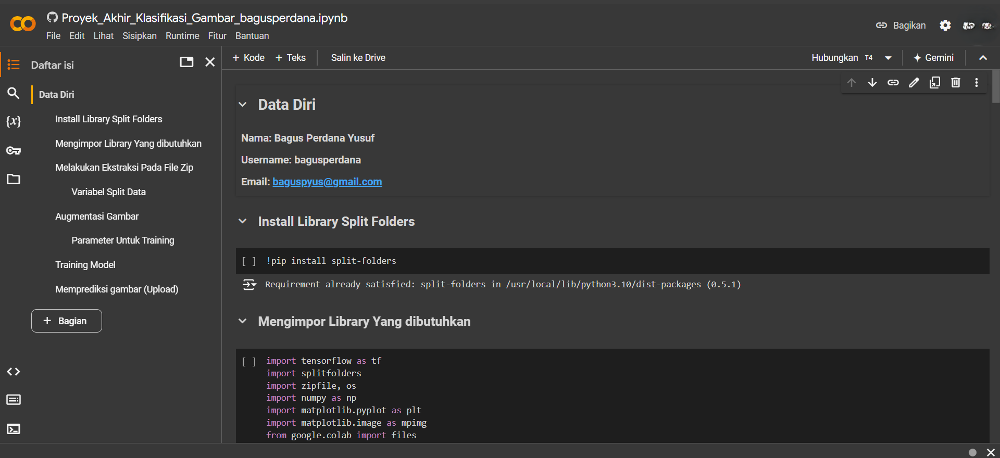

# Klasifikasi Gambar Batu-Kertas-Gunting

[**English Documentation (Dokumentasi Bahasa Inggris)**](../../README.md)

Sebuah program pembelajaran mesin dikembangkan menggunakan Python dan TensorFlow, yang mengimplementasikan algoritma Convolutional Neural Network untuk mengklasifikasikan gambar batu-gunting-kertas. Program ini dirancang untuk mendukung penyelesaian kursus Belajar Machine Learning untuk Pemula dari Dicoding Indonesia.

## Technology stack & Tools

**Program ini membutuhkan:**

| Tech Stack & Tools  | Version |
| ------------------- | ------- |
| Python              | 3.8+    |
| Google Colaboratory | Latest  |
| split-folders       | 0.5+    |
| TensorFlow          | 2.13+   |
| Numpy               | 1.24+   |
| Matplotlib          | 3.7+    |

## Setup (Google Colab)

### Clone the repository

Karena program ini berjalan di Google Colab, bukalah Google Colab.

[](https://colab.research.google.com/)

Dan klona repositori saya:

```shell
git clone https://github.com/bagusperdanay7/final-project-dicoding.git
```

1. Buka Google Colab
2. Pilih menu File > Buka notebook > GitHub
3. Salin '<https://github.com/bagusperdanay7/final-project-dicoding>' pada kotak input
4. Cari and dan tunggu untuk memuat repositori.
5. Pilih repository yang muncul.
6. Dan bum. Jalankan program.
7. Pilih Runtime > Jalankan semua


